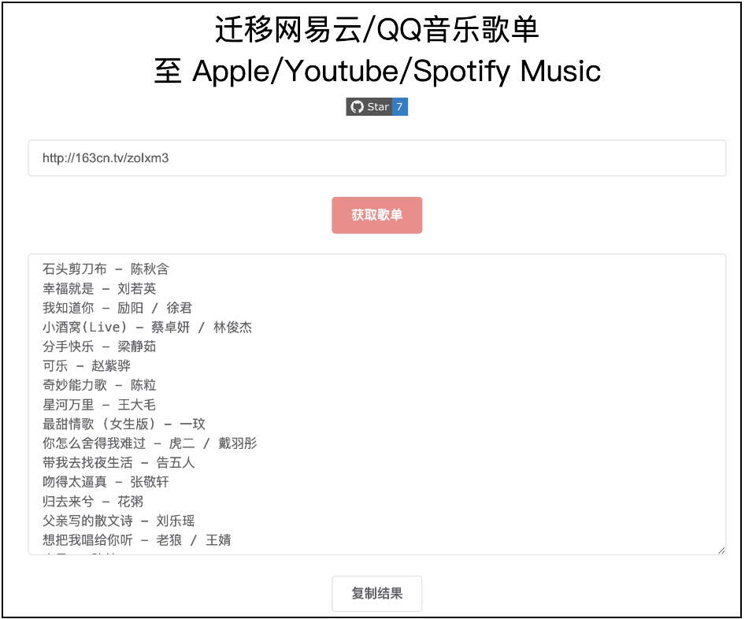

# 迁移网易云/汽水/QQ音乐歌单至 Apple/Youtube/Spotify Music

项目后端使用 Golang + Gin 开发，前端使用 Vue + ElementUI 编写。



# 使用指南

> 去除掉原代码中的mysql和redis，更适合个人使用
> 打开GoMusic.exe 服务（可下面自构建为linux可用）在windows本地，并使用PlaylistCreate.py进行当前目录下歌单整理。

# 如何启动程序？

- 安装 Golang
- 将程序克隆至本地
- 编译并运行

```shell
git clone https://github.com/Bistutu/GoMusic.git
cd GoMusic
go build &&./GoMusic
```
